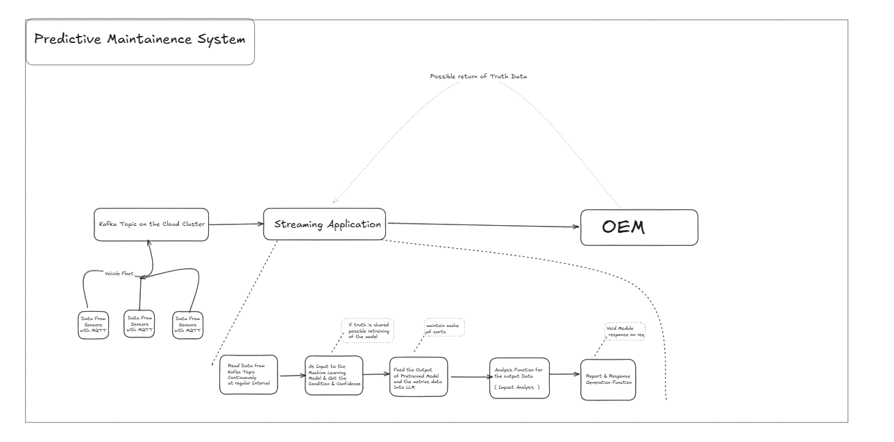

# Predictive Maintenance System

## Overview
The **Predictive Maintenance System** leverages AI/ML with GenAI and real-time analytics to forecast potential equipment failures, optimize maintenance schedules, and minimize operational downtime.

## Features
- **Real-time Monitoring:** Collects sensor data from IoT-enabled devices.
- **Anomaly Detection:** Uses machine learning to identify deviations in equipment behavior.
- **Predictive Modeling:** Forecasts failures and maintenance needs using historical data.
- **Alerting & Notifications:** Sends alerts when anomalies or potential failures are detected using genai for proper formation of the flow of the application.
- **Dashboard & Visualization:** Provides an intuitive UI for monitoring and analytics.

## Tech Stack
- **Cloud Platform:** Azure & Kafka Cloud
- **Big Data Processing:** Apache flink usage is the idea
- **Machine Learning:** Python, Sklearn's Random forest is used in this implementation
- **Backend:** Spring Boot (Java) for API services
- **Frontend (Optional):** Streamlit

## Architechture Diagram

## Usage
- Connect IoT devices to the system for data ingestion.
- Train and deploy predictive models.
- Monitor equipment health through dashboards.
- Receive notifications for potential failures.

## Contributing
Contributions are welcome! Please follow the standard GitHub workflow:
1. Fork the repository
2. Create a feature branch (`git checkout -b feature-name`)
3. Commit your changes (`git commit -m "Add feature"`)
4. Push to the branch (`git push origin feature-name`)
5. Open a Pull Request & if you could add some images of the implmentation on how it would look is appreciated

## License
This project is licensed under the MIT License.

## Contact
For any inquiries contact me socially via any media